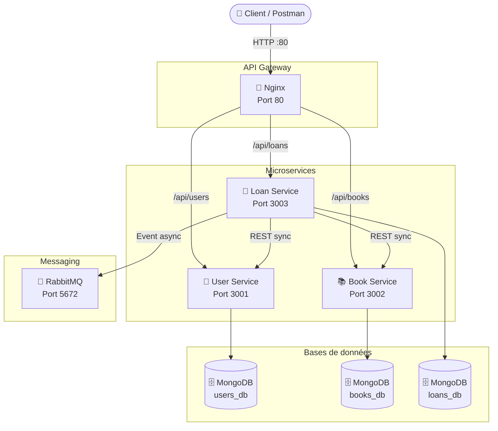
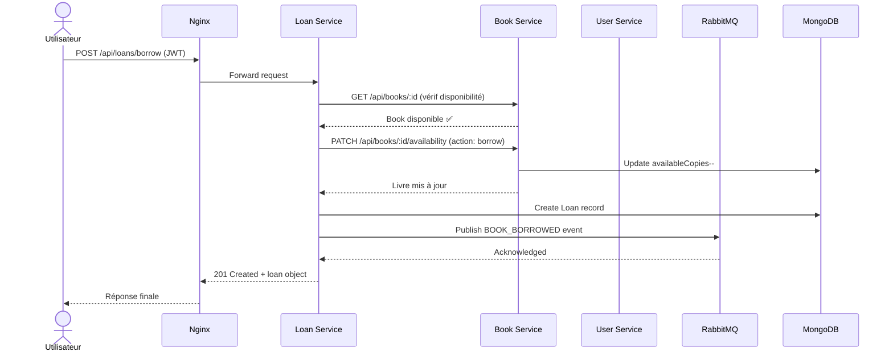
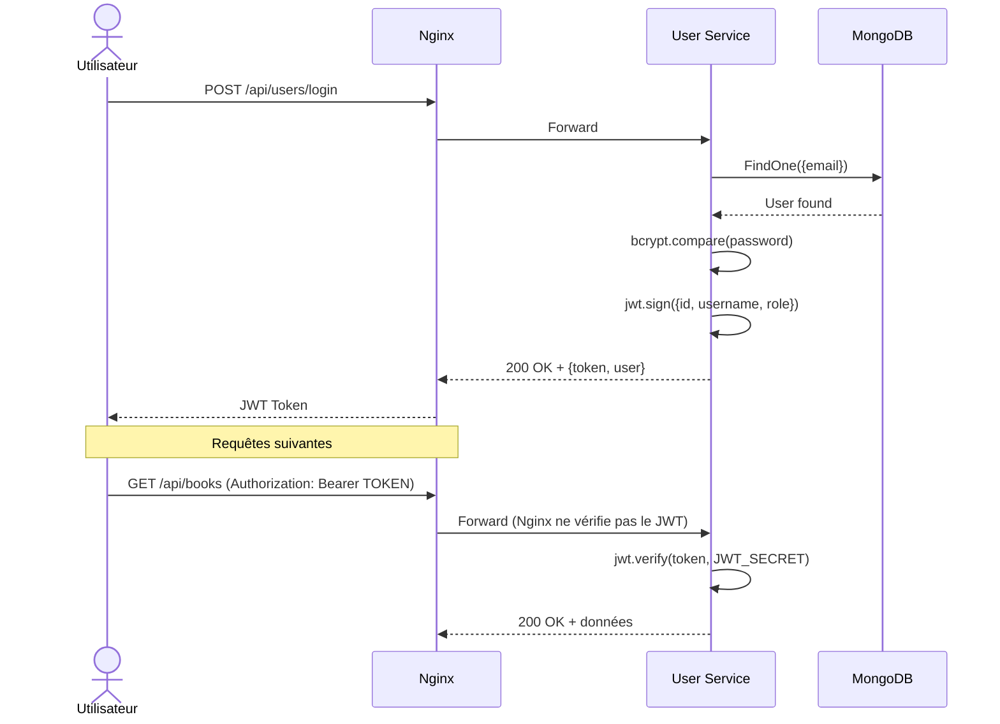
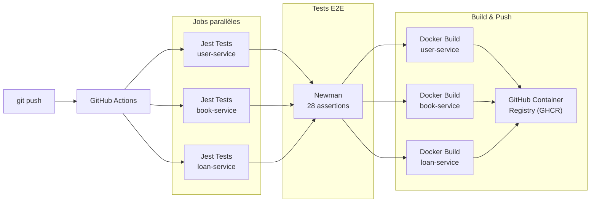
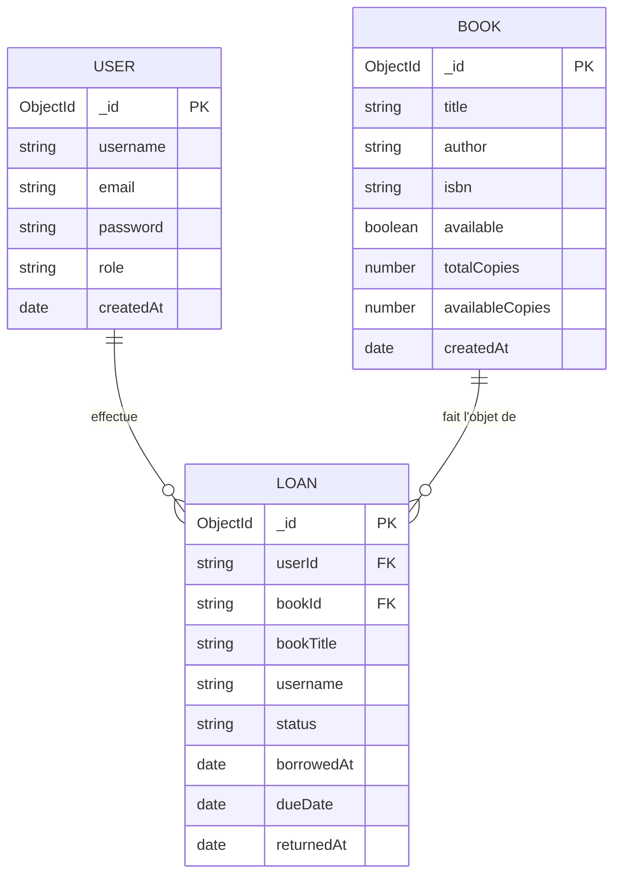

# 📚 Library Microservices — Système de Gestion de Bibliothèque


Architecture microservices complète avec Docker Compose, RabbitMQ, JWT et Nginx.

---

## 📋 Table des matières

- [Architecture](#architecture)
- [Prérequis](#prérequis)
- [Installation](#installation)
- [Configuration](#configuration)
- [Utilisation](#utilisation)
- [Tests](#tests)
- [CI/CD](#cicd)
- [Maintenance](#maintenance)
- [Choix techniques](#choix-techniques)

---

## 🏗️ Architecture

### Vue d'ensemble



### Flux d'un emprunt de livre



### Flux d'authentification JWT



### Pipeline CI/CD



### Structure des données



---

## 🔧 Prérequis

| Outil | Version minimale | Lien |
|---|---|---|
| Docker Desktop | 24.x | https://www.docker.com/products/docker-desktop |
| Docker Compose | v2.x | Inclus avec Docker Desktop |
| Git | 2.x | https://git-scm.com |
| Node.js | 18.x LTS | https://nodejs.org (pour les tests locaux) |
| Postman | Dernière version | https://www.postman.com/downloads |

---

## 🚀 Installation

### 1. Cloner le dépôt

```bash
git clone https://github.com/Zamily-8/library-microservices.git
cd library-microservices
```

### 2. Démarrer tous les services

```bash
docker compose up --build -d
```

### 3. Vérifier que tout tourne

```bash
docker compose ps
```

Tous les containers doivent être en état `healthy`.

### 4. Tester l'API Gateway

```bash
curl http://localhost/health
# Réponse : {"status":"OK","gateway":"nginx"}
```

---

## ⚙️ Configuration

Les variables d'environnement sont définies dans `docker-compose.yml` :

| Variable | Service | Description |
|---|---|---|
| `MONGO_URI` | Tous | URI de connexion MongoDB |
| `JWT_SECRET` | Tous | Clé secrète pour signer les tokens JWT |
| `JWT_EXPIRES_IN` | User | Durée de validité du token (défaut: 7d) |
| `RABBITMQ_URL` | Loan | URL de connexion RabbitMQ |
| `USER_SERVICE_URL` | Loan | URL interne du User Service |
| `BOOK_SERVICE_URL` | Loan | URL interne du Book Service |

> ⚠️ **En production**, ne jamais mettre les secrets dans `docker-compose.yml`. Utiliser des secrets Docker ou des variables d'environnement système.

---

## 📖 Utilisation

### Ports exposés

| Service | Port | URL |
|---|---|---|
| API Gateway (Nginx) | 80 | http://localhost |
| RabbitMQ Management | 15672 | http://localhost:15672 |

### Endpoints disponibles

#### User Service (`/api/users`)
| Méthode | Route | Auth | Description |
|---|---|---|---|
| POST | `/register` | ❌ | Créer un compte |
| POST | `/login` | ❌ | Se connecter |
| GET | `/profile` | ✅ JWT | Voir son profil |
| GET | `/:id` | ✅ JWT | Voir un profil par ID |

#### Book Service (`/api/books`)
| Méthode | Route | Auth | Description |
|---|---|---|---|
| GET | `/` | ✅ JWT | Lister tous les livres |
| GET | `/:id` | ✅ JWT | Voir un livre |
| POST | `/` | ✅ JWT | Créer un livre |
| PUT | `/:id` | ✅ JWT | Modifier un livre |
| DELETE | `/:id` | ✅ JWT | Supprimer un livre |
| PATCH | `/:id/availability` | ✅ JWT | Changer la disponibilité |

#### Loan Service (`/api/loans`)
| Méthode | Route | Auth | Description |
|---|---|---|---|
| POST | `/borrow` | ✅ JWT | Emprunter un livre |
| POST | `/return/:id` | ✅ JWT | Retourner un livre |
| GET | `/my` | ✅ JWT | Mes emprunts |
| GET | `/` | ✅ JWT | Tous les emprunts |

### Exemple d'utilisation complète

```bash
# 1. S'inscrire
curl -X POST http://localhost/api/users/register \
  -H "Content-Type: application/json" \
  -d '{"username":"alice","email":"alice@example.com","password":"password123"}'

# 2. Se connecter et récupérer le token
TOKEN=$(curl -s -X POST http://localhost/api/users/login \
  -H "Content-Type: application/json" \
  -d '{"email":"alice@example.com","password":"password123"}' | \
  python -c "import sys,json; print(json.load(sys.stdin)['token'])")

# 3. Créer un livre
curl -X POST http://localhost/api/books \
  -H "Content-Type: application/json" \
  -H "Authorization: Bearer $TOKEN" \
  -d '{"title":"1984","author":"George Orwell","totalCopies":3}'

# 4. Emprunter le livre (remplacer BOOK_ID)
curl -X POST http://localhost/api/loans/borrow \
  -H "Content-Type: application/json" \
  -H "Authorization: Bearer $TOKEN" \
  -d '{"bookId":"BOOK_ID"}'
```

---

## 🧪 Tests

### Tests Jest (unitaires + intégration)

```bash
# User Service
docker compose exec user-service sh -c "NODE_ENV=test npm install --include=dev && NODE_ENV=test npm test"

# Book Service
docker compose exec book-service sh -c "NODE_ENV=test npm install --include=dev && NODE_ENV=test npm test"

# Loan Service
docker compose exec loan-service sh -c "NODE_ENV=test npm install --include=dev && NODE_ENV=test npm test"
```

**Résultats :**
- User Service : 10/10 tests ✅
- Book Service : 11/11 tests ✅
- Loan Service : 8/8 tests ✅
- **Total : 29/29 tests ✅**

### Tests Newman (E2E)

```bash
docker run --rm \
  --network library-microservices_library-network \
  -v "${PWD}/postman:/etc/newman" \
  postman/newman:alpine \
  run /etc/newman/library-api.collection.json \
  --env-var "baseUrl=http://nginx-gateway:80" \
  --reporters cli
```

**Résultats : 28/28 assertions ✅**

---

## 🔄 CI/CD

Le pipeline GitHub Actions se déclenche automatiquement à chaque `git push` sur `main` :

1. **Tests Jest** — 3 jobs parallèles (un par service)
2. **Tests Newman** — Tests E2E sur l'stack complète Docker
3. **Build & Push** — Images Docker poussées sur GHCR

Badge de statut : 

---

## 🔧 Maintenance

### Commandes utiles

```bash
# Démarrer tous les services
docker compose up -d

# Arrêter tous les services
docker compose down

# Voir les logs d'un service
docker compose logs user-service -f

# Redémarrer un seul service
docker compose restart book-service

# Reconstruire après modification du code
docker compose up --build -d

# Voir l'état des containers
docker compose ps
```

### Procédure de rollback

En cas de problème après une mise à jour :

```bash
# 1. Identifier le commit précédent
git log --oneline -5

# 2. Revenir au commit précédent
git revert HEAD

# 3. Pousser le rollback
git push

# 4. Reconstruire les containers
docker compose up --build -d
```

### Mise à jour d'un service

```bash
# 1. Modifier le code du service
# 2. Reconstruire uniquement ce service
docker compose up --build -d user-service

# 3. Vérifier qu'il est healthy
docker compose ps user-service
```

### Sauvegarde des données

```bash
# Sauvegarder users
docker exec mongo-users mongodump --db users_db --out /tmp/backup
docker cp mongo-users:/tmp/backup ./backup/users

# Sauvegarder books
docker exec mongo-books mongodump --db books_db --out /tmp/backup
docker cp mongo-books:/tmp/backup ./backup/books

# Sauvegarder loans
docker exec mongo-loans mongodump --db loans_db --out /tmp/backup
docker cp mongo-loans:/tmp/backup ./backup/loans
```

---

## 🏛️ Choix techniques

### Pourquoi des microservices ?
Chaque service est **indépendant** : on peut le déployer, le scaler ou le modifier sans toucher aux autres. User Service peut être mis à jour sans redémarrer Book Service.

### Pourquoi une MongoDB par service ?
Respecter le principe **"Database per Service"** : chaque service est propriétaire de ses données. Loan Service ne peut pas modifier directement la base de Users — il doit passer par l'API.

### Pourquoi RabbitMQ ?
Pour la **communication asynchrone** : quand un livre est emprunté, 
Loan Service publie un événement `BOOK_BORROWED` dans la queue 
`loan_events` sans attendre de réponse. Le système est conçu pour 
que d'autres services puissent écouter ces événements 
indépendamment. RabbitMQ nécessite une configuration spéciale au 
démarrage : le Loan Service attend que RabbitMQ soit en état 
`healthy` avant de tenter la connexion, avec un mécanisme de 
retry automatique (jusqu'à 10 tentatives).

### Pourquoi Nginx comme API Gateway ?
Point d'entrée **unique** pour tous les clients. Il route les requêtes vers le bon service selon l'URL, masque la complexité interne et peut gérer le load balancing.

### Pourquoi JWT ?
Authentification **stateless** : le token contient toutes les infos nécessaires (id, rôle). Chaque service peut vérifier le token sans appeler User Service à chaque requête.

### Pourquoi Docker Compose ?
**Orchestration locale** simple : une seule commande démarre les 8 containers avec leurs réseaux, volumes et dépendances correctement configurés.
